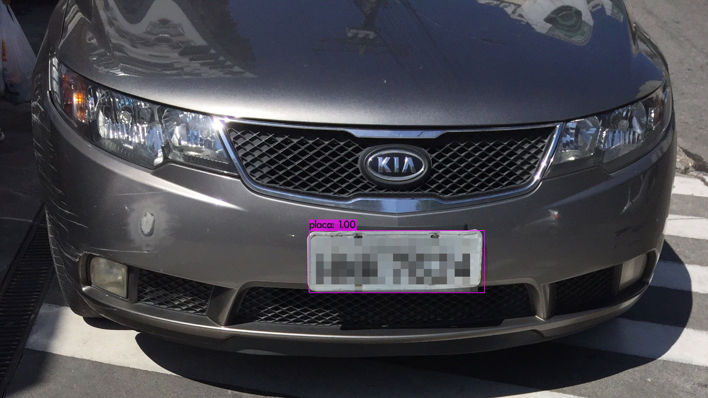

# Detecção de Placas de Veículos com YOLOv4
Sistema para detecção de placas de veículos em imagens com base na arquitetura You Only Look Once (YOLO) versão 4. O modelo construído foi treinado a partir de um dataset com 400 imagens de placas de carros, fotografadas em diferentes períodos do dia. Para baixar o arquivo de pesos, clique [AQUI.](https://drive.google.com/file/d/1uoMaXB5AfXEdwQyIdg98bwe50YfxM1n5/view?usp=sharing)

